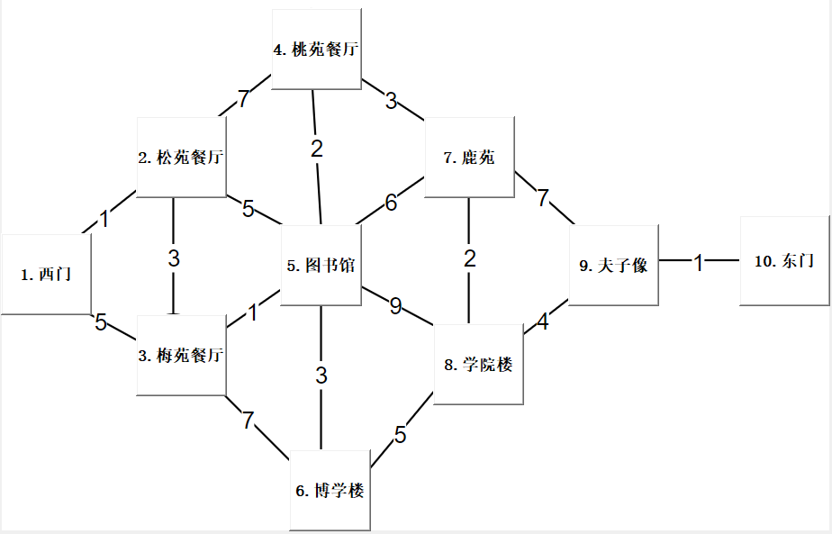
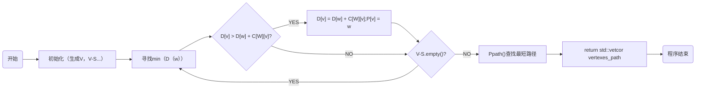
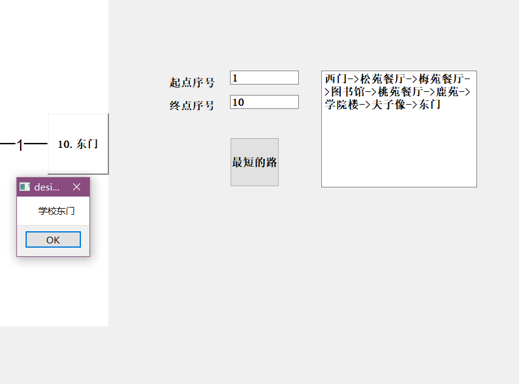
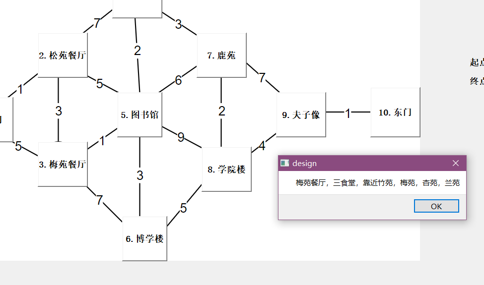
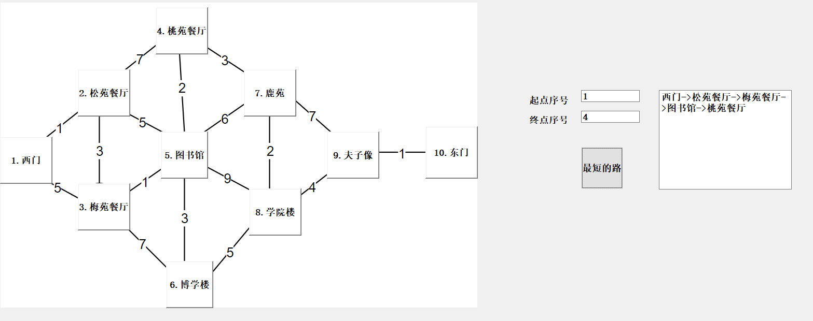
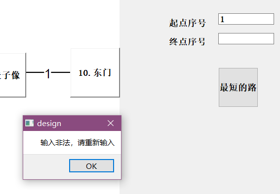

# Course_Design_of_Data_Structure

***数据结构与算法分析课程设计***
项目地址：https://github.com/robostar-ye/Course_Design_of_Data_Structure

开发环境：win10+Cmake3.17+mingw-w64-8.1.0+CLion2020.3+Qt5.12.10

## 一.  选题

 校园导游咨询

问题描述：

1）设计校园平面图，所含景点不少于10个。以图中定点表示学校各景点，存放景点名称、代号、简介等信息，以边表示路径，存放路径长度等相关信息。

2）为来访客人提供图中任意景点的问路查询，即查询任意两个景点之间的一条最短的简单路径

3）为来访客人提供图中任意景点相关信息的查询

测试数据：由读者根据实际情况指定。

实现提示：一般情况下，校园的道路是双向通行的，可设校园平面图是一个无向图。顶点和边均含有相关信息。

## 二.  选题分析

​		设校园平面图为一个无向图，可以采用一个邻接矩阵来表示这个无向图，为了方便，邻接矩阵可用std::vector<std::vector<class object>>来表示，而图中的节点则代表校园中的景点。关于景点可单独设一个景点的类，用来储存景点名称、代号、简介等信息。查询景点信息时直接调用对象的简介信息即可。

​		此问题的核心问题即查询任意两个景点之间的一条最短的简单路径，即路径规划问题，则可采用迪杰斯特拉（Dijkstra）算法或弗洛伊德（ShortestPath）算法。

​		核心问题解决后，则图形演示可采用Qt解决。

## 三.  设计无向图



## 四. 代码设计

### 1  . 整体思路

该工程分分两部分进行。第一部分，校园数据和路径规划，在这里我声明了一个Place类用来表示各个地点，声明如下：

```C++
class Place {
public:
/***************略*****************************/

private:
    std::string name_; // 景点名称
    std::string introduction_; // 景点介绍
    int num_; // 景点编号
    bool flag_ = false;  // 迪杰斯特拉算法是否遍历标识位
};
```

然后在此基础上声明一个School类，用来表示学校的景点集合，声明如下：

```c++
class School {
public:
    School(){}; //  创建一个校园风景区
    ~School(){};
    void Init();
    std::vector<Place> ShortestPath(Place start_point, Place end_point); //
    std::vector<Place> ShortestPath(int num_start_point, int num_end_point); // 最短路径实现函数，实质为迪杰斯特拉算法
    void Ppath(std::vector<int> path, int i, int v, std::vector<Place> &vertexe_path);
private:
    std::vector<Place>vertexes;//顶点表
    std::vector<std::vector<int>>adjacency_matrix;//邻接矩阵，相当于边表
    int num_vertex = 0; // 顶点数
    int num_edges = 0;  // 边数
};
```

这部分的核心，迪杰斯特拉算法输入的是起点和终点的编号，输出的是包含各个景点的Place对象组成的std::vector容器（实质为顺序表），该函数流程图如下。



第二部分UI界面，采用Qt5.12.10来实现界面交互，设置了十个pushbutton来表示各个地点，按下按键可以显示景点介绍，两个lineEDIT来进行起点终点序号输入，通过一个pushbutton关联两个lineEDIT，并调用School类里面的Dijkstra算法，通过textBrows输出结果。

```c++
void MainWindow::on_button_min_path_clicked() {
    int num_start_point = ui->lineEdit_num_start_point->text().toInt() - 1;
    int num_end_point = ui->lineEdit_num_end_point->text().toInt() - 1;

    if (!ui->lineEdit_num_start_point->text().isEmpty() && !ui->lineEdit_num_end_point->text().isEmpty() && num_start_point >= 0 && num_start_point <= 9 && num_end_point >= 0 && num_end_point <= 9) {
        std::vector<Place> result_temp = CUMT.ShortestPath(num_start_point, num_end_point);  // 调用Djkstra算法
        QString result_qstring;
        std::string result_string;
        int num_temp = result_temp.size();
        for (int i = 0; i < num_temp; i++) { // 从std::vectoer<Place>中提取路径名称
            result_string += result_temp[i].name();
            if (i != num_temp - 1) result_string += "->";
        }

        result_qstring = QString::fromStdString(result_string); // 转换为qstring

        ui->textBrowser_result_min_path->clear();
        ui->textBrowser_result_min_path->append(result_qstring);
    } else {
        msg_intro.setText("输入非法，请重新输入");
        msg_intro.exec();
    }
}
```

### 2. 存储结构

涉及存储结构的内容有，图的存储，在这里我采用std::vector < std::vector<int> >类型的二维数组进行存储邻接矩阵，类似的一位数组存储邻接表，而用的vector容器实质上是一个顺序表，因为时间时间关系就没有自己实现，而直接调用stl模板库的vector容器。

### 3.输入输出

程序整体的输入输出都在图形界面完成。一方面是输出终点起点序号，输出最短路径，另一方面是点击对应地点弹出简介。效果如图。



### 4. 创新点

采用Qt5创建用户交互界面，让用户更加方便，简单的获取到自己想要获得的信息。

将整个校园看做一个无向图，使用Dijkstra算法快速为用户计算出最短的路径，更加节省你的时间。

## 五.效果展示

### 1.点击地点展示简介



### 2.路径规划



### 3.错误输入提示



## 六. 后续改进计划

###  1. 

因为赶时间，所有地点数据都是直接写在cpp文件里的，一旦更改就需要重新编译，后续可以考虑将其单独放在一个文件里，可执行文件执行时直接读取这个文件，更改数据后无需再次编译。

### 2.

给出的最短路已经目前是放在文本框里的，后续可以考虑在地图上显示出一条线来。

### 3.

最短路径采用的迪杰斯特拉算法实际上遍历了起点到其他所有的点的路径，浪费了无用的计算力，

## 七.  注意事项

1. 安装qt时，为了使cmake能够find_package成功，Qt5必须能够找到CMAKE_PREFIX_PATH，或者Qt5_DIR必须在CMake缓存中被设置用来找到Qt5WidgetsConfig.cmake 文件的位置。
2. 注意qstring与std::string的区别。
3. 因为程序采用动态编译，单独运行时没有相关环境时，可能无法正常运行。

